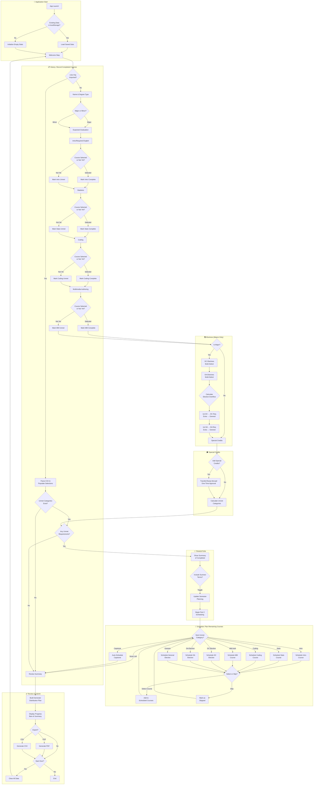
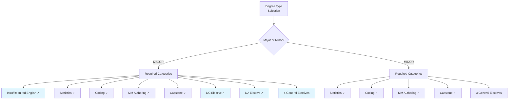
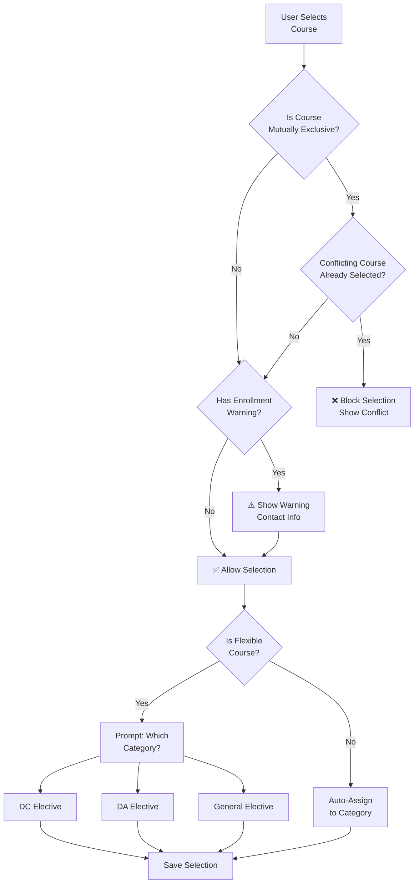
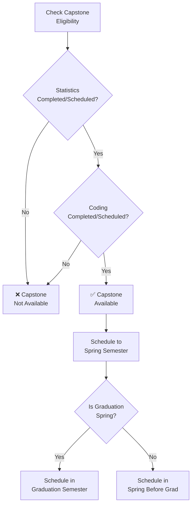
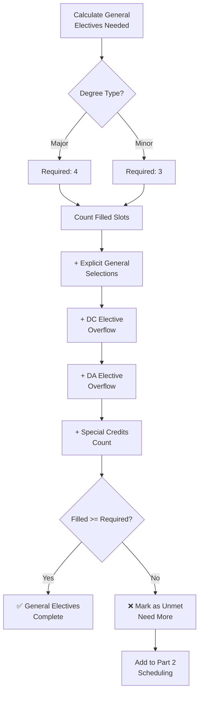
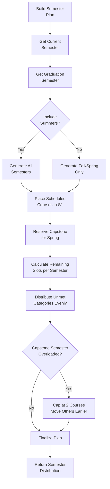
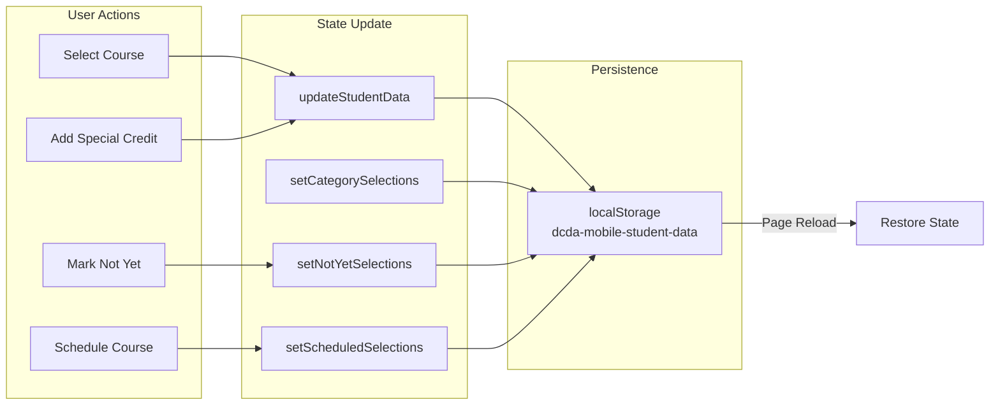

# DCDA Advisor Mobile - Application Flow Chart

## High-Level Application Flow

## Degree Type Decision Tree

## Course Selection Validation Logic

## Capstone Prerequisites Logic

## General Electives Calculation

## Semester Distribution Algorithm

## Data Persistence Flow

---

## Legend

| Symbol | Meaning |
|--------|---------|
| 📋 | History - Recording completed courses |
| 📅 | Schedule - Planning remaining requirements |
| ✅ | Review & Submit |
| ✓ | Required for degree |
| ❌ | Blocked/unavailable |
| ⚠️ | Warning/caution |

## Key Decision Points Summary

1. **Degree Type** → Determines which steps appear and requirements count
2. **Course Selection vs Not Yet** → Determines if category goes to Part 2
3. **CSV Import** → Can skip Part 1 entirely
4. **Elective Overflow** → Extra electives auto-fill general elective slots
5. **Capstone Prerequisites** → Must have stats + coding before capstone
6. **Summer Toggle** → Affects how courses distributed across semesters
